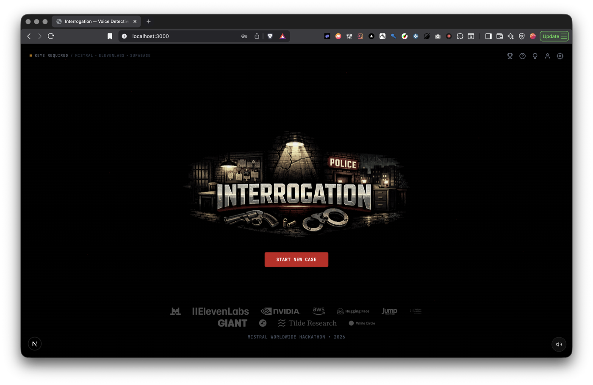

# Interrogation

A fictional noir detective game built by Jason Poindexter for a hackathon. Question an AI suspect, compare its account with the case, and make a specific accusation.

The current upgrade targets a **local video demonstration** using a signed-in Codex subscription, with ElevenLabs voice and a separate OpenAI API adapter for future hosting. Integration is active: one generated public CLI playthrough completed case preparation, three questions, evidence release, a supported accusation and result recovery. Preparation took 70.667 seconds. The earlier 77.144-second review failure remains recorded; this small sample does not establish broad fairness or reliability. Browser and voice acceptance remain unverified. See [current implementation status](docs/audit/IMPLEMENTATION-STATUS.md). See [the audit](docs/audit/AUDIT.md), [implementation plan](docs/audit/IMPLEMENTATION-PLAN.md) and [gameplay upgrade](docs/audit/GAMEPLAY-UPGRADE.md) for evidence and remaining acceptance work.



*This screenshot records the earlier hackathon version; it is not proof of the current runtime.*

## Run locally

Use **Node.js 24** and **npm 11**. The repository pins exact application dependencies in `package-lock.json`.

```bash
npm ci
[ -f .env.local ] || cp .env.example .env.local
npm run dev
```

Open `http://127.0.0.1:3000`. The development server binds to loopback and does not terminate unrelated processes using nearby ports.

For a production rehearsal, run `npm run build` and `npm run start -- --hostname 127.0.0.1 --port 3187`, then open `http://127.0.0.1:3187`. Pass the hostname explicitly because plain `next start` defaults to all network interfaces. The [fresh-checkout report](docs/audit/FRESH-CHECKOUT.md) records an executed clean install, build, authored game and restart recovery at its stated commit.

The local Codex adapter uses the project CLI and its existing local sign-in. Before a live demonstration, check the installed CLI and sign in interactively if needed:

```bash
./node_modules/.bin/codex --version
./node_modules/.bin/codex login status
./node_modules/.bin/codex login
```

Do not copy local Codex authentication files into the repository, browser or hosted deployment. A Codex subscription is not an OpenAI API key; the hosted API path requires separate credentials and API billing. Local usage remains subject to the signed-in account's availability and limits.

## Server configuration

These are server environment variables, never browser settings. The provider migration is being integrated; use the configuration report and an actual game turn to validate the selected path.

| Variable | Purpose |
|---|---|
| `AI_PROVIDER` | `codex-local` for the local subscription adapter; `openai` for the API adapter |
| `CODEX_BIN` | Optional local Codex executable override; defaults to the project CLI |
| `CODEX_MODEL` | Local model selection; default is `gpt-6.1-sol`; `gpt-6-luna` remains an explicit lower-usage option |
| `CODEX_CASE_MODEL` | Case drafting model; defaults to `gpt-6-luna`. Independent review, dialogue and judging use `CODEX_MODEL` |
| `AI_GENERATION_TIMEOUT_MS` | Overall case drafting/review limit, default 120000 ms; individual calls retain `AI_TIMEOUT_MS` |
| `OPENAI_API_KEY`, `OPENAI_MODEL` | Separate OpenAI API adapter credentials and model |
| `ELEVENLABS_API_KEY` | Optional voice input and spoken replies; text remains available without it |
| `AI_WORK_ENABLED` | Set `false` and restart the local server to stop new structured AI and embedding calls |
| `ELEVENLABS_STT_MODEL` | Defaults to `scribe_v2` in the voice adapter |
| `ELEVENLABS_TTS_MODEL` | Defaults to `eleven_flash_v2_5` in the voice adapter |
| `INTERROGATION_DATA_DIR` | Optional private local data directory; defaults to `.local` |
| `LEADERBOARD_STORAGE` | Local files by default; optional `supabase` server backend |
| `SUPABASE_URL`, `SUPABASE_SERVICE_ROLE_KEY` | Optional managed project origin (`https://<project>.supabase.co`) and server credential; custom domains, self-hosted targets and redirects are unsupported |
| `EXPORT_SECRET` | Bearer credential for the private export endpoint |
| `EXPORT_STORAGE` | Local exports by default; optional `supabase` backend |

`GET /api/health` and Settings separate **configuration from observed request outcomes**. Reading status never calls a model or voice provider. A recent requested operation can report success, authentication rejection, rate limiting, unavailable service or an unclassified failure, with its timestamp. Observations expire after five minutes and clear on server restart or provider configuration changes. Generic CLI errors remain unclassified. “Configured” is not “tested,” and a successful past request does not guarantee the next request, audible playback, microphone access or database policies. See [status acceptance and limits](docs/audit/HEALTH-ACCEPTANCE.md).

Preferences are stored under `appPreferences`. Only known nonsecret preferences are carried forward from older `appSettings` data. Legacy keys are not sent to providers or copied into new preference writes. They remain in the old storage entry until the user removes it; resetting preferences does not silently delete them.

Voice retries use private local receipts to avoid repeating provider work. The bounded server cache retains synthesized audio and transcription/error responses; a failed microphone clip remains only in the current view's memory for explicit retry/discard. See [voice storage and recovery](docs/audit/VOICE-IDEMPOTENCY.md) and [AI/voice work limits](docs/audit/SHARED-BUDGETS.md). Neither feature establishes real microphone or playback acceptance.

## Play

New-case preparation shows server-reported drafting/review stages and elapsed wait time. It does not display a fabricated completion percentage. A failed request explains recovery and offers the authored evidence case; it never silently substitutes a different case or starts another model attempt.

1. Choose a case and difficulty; read the briefing before beginning.
2. Ask questions using text or, when configured, voice. The case file distinguishes server-released case evidence from legacy dialogue clues. Open the accompanying exchange and explicitly add a quote to your question draft; the exchange records when a case note appeared, not proof that the suspect supplied it. Older clues without a recorded source say so. Notes use numbered markers rather than arbitrary object pictures.
3. In the reviewed evidence challenge, pin an exact statement, attach a disclosed exhibit, edit the question and explicitly send it. Clarify and Leave space offer different editable approaches.
4. Compare the cited result with the source. An irrelevant exhibit does not establish a contradiction, and repeating an established pair does not earn more progress.
5. Write the accusation yourself. The game freezes its accepted terminal result; a later debrief must not reverse it.

Both result screens include a compact **Conversation path** in the existing noir palette. Expand a step to review the exchange and its cited evidence. Gold identifies supported findings, red identifies rejected accusations or unsupported evidence challenges, and ordinary dialogue stays neutral. Live wording without a reviewed claim binding is explicitly unverified. The map records the route taken; it does not invent alternative conversations or score every question.

For a connection-free fallback, open **Recorded walkthrough** from Cases (`/rehearsal`). It uses saved exchanges, labels every screen Recorded / not live AI, and makes no model calls or score submissions. See [fallback provenance](docs/audit/RECORDED-FALLBACK.md).

New generated cases release a canonical case-file evidence summary after 3 / 5 / 7 / 9 distinct substantive accepted questions on Easy / Medium / Hard / Expert. Substantive means at least 15 letters; openings, accusations and normalized repeated questions do not advance that count. Release does not depend on stress, including zero stress. The note is a case-record summary, not a verbatim witness statement or suspect quote. Legacy dialogue clues remain available and visibly distinct. Once the interview begins, you can submit a specific accusation without waiting for the note; the judge evaluates the claim and an incorrect verdict consumes an attempt. Evidence practice requires an established statement-and-exhibit contradiction first. Recent generated samples exposed multiple false claims and ambiguous evidence, so generated-case fairness remains under evaluation. The authored evidence case is the current rehearsal target. Stress and vocal delivery are dramatic devices, not lie detection. The project makes no claim to teach real interrogation techniques or reliably infer guilt from behavior.

Timed challenge uses an authoritative server deadline that continues through provider requests and speech. Relaxed removes the deadline and pressure-triggered lawyer ending while preserving the selected difficulty; elapsed time does not reduce its score. Endurance removes the deadline but retains the Hard/Expert lawyer rule: four successive turns at stress 8 or higher end the interview. Both modes without a countdown are unranked. Provider allowances still apply. See `src/lib/scoring.ts` for scoring.

The actor now receives public case information and already disclosed evidence, rather than the private answer. Model-authored clue text cannot award progress. This limits privileged access; it does not prevent guessing, inference or hallucination. The actual live check stopped before play with `INVALID_REVIEW_EVIDENCE`; the changed disclosure path has controlled-route evidence, not a successful live playthrough. See [actor and evidence release](docs/audit/ACTOR-DISCLOSURE.md), [failed live check](docs/audit/DISCLOSURE-LIVE.md) and [source-reference correction](docs/audit/GENERATED-REVIEW-V4.md).

## Architecture and data

An AI agent can use the local JSON command interface through `npm run --silent agent:control`. It shares the same HTTP game rules as the browser and stores its session capability privately. Start with `printf '%s\n' '{"command":"discover"}' | npm run --silent agent:control`; see [agent controls and recovery](docs/AGENT-CONTROL.md). Commands run one action at a time; they do not start an autonomous play loop.

See the [current architecture](docs/ARCHITECTURE.md) and [local rehearsal runbook](docs/LOCAL-DEMO.md) for ownership, recovery and acceptance steps.

- `app/game/state/`, `app/game/view/`: client orchestration and presentation boundaries.
- `app/game/playbook/`: public evidence controls, editable approaches and source-cited feedback.
- `src/lib/session/`: transitions, transactions, durable local snapshots, canonical results and exports.
- `src/lib/gameplay/`: reviewed facts, public projections, recorded statements and idempotent challenge actions. Authored secret case data stays on the server.
- `src/lib/game-ai/`: case preparation, suspect dialogue and accusation judgment, using the selected provider.
- `src/lib/ai/`: provider contracts and local Codex/OpenAI migration.
- `src/lib/voice/`: server-side ElevenLabs transcription and speech authorization.
- `src/lib/leaderboard/`: receipt-based score storage. Public views do not mix in fictional seed scores.

Local session snapshots, score receipts and exports are private files under the data directory. They may include full transcripts, case secrets and private redemption data. Keep them out of version control and screen sharing. One-hour session expiry and 24-hour generation/voice receipt expiry limit availability; they do not erase the stored files. Custom data directories are not automatically covered by this repository’s `.gitignore`. Review/archive data only while the demo server is stopped, and do not retry archived request IDs against a fresh store. Optional hosted leaderboard migrations are documented in [database/README.md](database/README.md).

**Vercel readiness is incomplete.** The local session repository explicitly rejects hosted use without a shared durable session implementation. Configuring an API key or hosted leaderboard alone does not complete deployment. Verify hosted persistence, migrations, credentials and end-to-end behavior separately before publishing.

## Checks

Run checks appropriate to the changed behavior. Reserve the complete suite for integration checkpoints; documentation edits and repeated rehearsals do not need a full rerun. Keep live model and voice checks small and deliberate.

```bash
npm run lint        # zero-warning ESLint
npm run check:size  # file/function size and complexity gates
npm run typecheck   # Next route types + TypeScript
npm test            # deterministic tests, including TSX markup tests
npm run build       # production build
npm run verify      # all checks above
```

Executable handwritten modules have a 300-line ceiling, functions 50 lines, complexity 10 and at most four parameters. Split concerns rather than suppress rules. Data/fixtures and generated outputs need explicit treatment rather than being disguised as executable modules.

A passing build or mock test is not a live demo pass. The remaining demonstration gate includes real text and voice turns, an evidence challenge, canonical result, failure recovery, actual browser/keyboard behavior and rehearsed timing. Browser interaction previously lacked authorization; do not claim visual or keyboard verification from source inspection.

## Private exports

Configure `EXPORT_SECRET` on the server and in the operator's terminal, then run:

```bash
npx tsx scripts/export-data.ts --output=data/export.jsonl --limit=1000
```

The CLI reads the terminal environment; it does not automatically load `.env.local`. Supply the same `EXPORT_SECRET` privately in that terminal and set `EXPORT_BASE_URL=http://127.0.0.1:3187` when using the rehearsal port (default is `http://localhost:3000`). The secret travels in an Authorization header, never a URL query parameter. Each request exports at most 1,000 records; use `--offset=1000` and a different output filename for the next page. A successful export replaces an existing output file, so choose a fresh filename when preserving earlier evidence.

Exports include hidden case facts and full transcripts for private review; they are not presentation-ready public data. Optional historical retrieval is disabled by default and uses evidence-linked questions from completed wins. It does not establish that every game becomes harder, that failures improve the model, or that model weights retrain. See [retrieval evidence and limits](docs/audit/EVENT-GROUNDED-PATTERNS.md).

## History and claims

The original README identified the project as a Mistral Worldwide Hackathon 2026 entry and described Mistral dialogue, Voxtral transcription and ElevenLabs speech. Git history is preserved. The earlier model names and sponsor artwork are historical context, not the current provider contract or evidence of an award.

The audit reviewed 98 reachable commit subjects and selected implementation diffs. It found correctness, security, accessibility and maintainability gaps; individual fixes require their own executed evidence. Unsupported career metrics, awards and claims of guaranteed secrecy or automatic model learning have been removed from the demo copy and recorded in [the copy accuracy ledger](docs/audit/COPY-ACCURACY.md) for verification.

## Portfolio delivery

The full Interrogation case study was built in parallel in the existing V8 portfolio and pushed as [portfolio commit 596306a](https://github.com/jpoindexter/portfolio-site/commit/596306a) on `codex/interrogation-case-study`. Its production build, scoped lint and local HTTP route checks passed. It is not deployed; visual review and publication remain separate. Its game evidence is explicitly pinned to `ea703ca`, before the newer actor/evidence-release changes. The separate game website is deferred.
