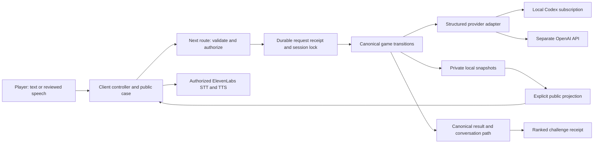

# Current architecture

Source review: 3 October 2026. This describes the working tree, not a published release. Historical findings remain under `docs/audit/`. See [acceptance coverage](audit/ACCEPTANCE-COVERAGE.md) for what has actually been exercised.

## Boundaries and ownership

| Owner | Source | Authority and limits |
|---|---|---|
| Browser presentation | `app/game/controller`, `state`, `view`, `playbook` | Owns drafts, visible phase, panels, audio controls and stable request IDs. Cannot award clues, set outcome or submit a trusted score. |
| Session service | `src/lib/session` | Owns private case, accepted transcript, clues, attempts, clock anchor, mode, terminal outcome and persisted receipts. |
| Reviewed evidence rules | `src/lib/gameplay` | Owns authored claim/exhibit relationships. Exact pinned text and disclosed exhibits support a challenge; unreviewed live wording has no invented correctness verdict. |
| AI boundary | `src/lib/ai`; game operations in `src/lib/game-ai` | Selects provider, schema, timeout and cancellation. Actor prose does not directly establish guilt or evidence progress. The model judges accusations; the accepted judgment is frozen once. |
| Voice boundary | `src/lib/voice`, `app/game/audio` | Authorizes speech against accepted session utterances; validates recording uploads. Playback owns cancellation and browser resource cleanup. Real microphone/ElevenLabs behavior is not yet proven. |
| Results and storage | `app/game/result`, `src/lib/leaderboard`, `database` | Debrief projects stored facts, not a second judgment. Only canonical timed challenge wins can enter the ranked leaderboard. |

## State and time

A session moves `briefing → active → won/lost`. The first admitted opening request begins server time before provider work; reading the briefing does not. Provider waiting and failed attempts therefore count toward a running challenge clock. Terminal outcomes are win, failed accusations, deadline, give-up, or lawyer. `finishSession` cannot overwrite an existing result. The client wall clock is synchronized to server timestamps, catches up after backgrounding, and does not emit a fresh timeout while restoring a terminal result.

Mode is frozen at creation. **Challenge** has a countdown and ranked score. **Relaxed** keeps the selected difficulty without countdown or lawyer pressure. Generated accusations require an active interview and remaining attempts; the canonical evidence note is not an accusation gate. Authored evidence practice requires an established statement-and-exhibit contradiction before accusation. **Endurance** is untimed but permits sustained-stress lawyer endings on hard/expert. Both untimed scores use zero elapsed time in the formula while retaining actual duration in stats; both are unranked. Old result caches without mode remain explicitly unknown.

## System condition → player behavior

| Condition | Visible behavior/control | Recovery and evidence |
|---|---|---|
| Generation or turn takes seconds | Processing state preserves prior dialogue; no invented progress percentage | Stable request ID permits committed-response replay. `tests/request-ledger.test.ts`, generation tests. Browser status timing still needs inspection. |
| Transport response is lost | Retry the same action | Pending receipt precedes provider work; completed state/response persist before success. Child-process tests cover crash and restart, not a guarantee of provider billing reversal. |
| Generation completed but delivery failed | Resume the same case | Reserved session ID + private validated-case checkpoint recover before/after session materialization. No new inference after that checkpoint. |
| Process dies before a recoverable checkpoint | Explicit interrupted state | A new attempt is a player decision; the external provider's outcome cannot be reconstructed safely. |
| Voice is unavailable or cancelled | Text remains usable; playback can stop/skip | Fake-resource lifecycle and route tests verify cleanup logic. Actual speakers, mic and call audio remain separate acceptance. |
| A live sentence lacks reviewed factual binding | “Statement not reviewed” | Dialogue remains usable; it is not labelled wrong or awarded evidence progress. |
| Browser result storage is blocked | Server-backed result URL/recovery path | Canonical server result is retained; storage-failure fixtures exist. Actual blocked-storage navigation remains unverified. |
| AI allowance exhausted or operator stopped work | Explicit allowance/stop error; current transcript remains available | The provider gateway checks durable session/operator work limits before adapter entry. A completed denial is a saved failed receipt; a new attempt requires resolving the condition first. |

The client validates case options, timer anchors and public evidence references before accepting recovery or action data. Source IDs must be unique, pinned text must belong to its recorded turn, and a challenge's reply/counts must match its public projection. Unknown case fields are discarded rather than copied into client state. These checks validate transport consistency; they do not establish the truth of model-authored facts.

## Actor facts and evidence release

The suspect actor receives an allowlisted public case projection and already disclosed evidence. Private truth, contradiction, true story and authored sealed notes stay outside its initial input; the accusation judge and terminal debrief still receive the canonical private case. Model-authored clue text no longer changes progress. Public facts may still support inference or guessing, and the actor can hallucinate; this is an access boundary, not a semantic secrecy guarantee.

Generated evidence release is server-owned: the decisive case note appears after 3 / 5 / 7 / 9 distinct substantive accepted questions on Easy / Medium / Hard / Expert. Substantive questions contain at least 15 letters. Openings, accusations and normalized repeats do not count. Stress, including zero, cannot block release. The exact canonical contradiction is labelled a case-file evidence summary with `origin: case-record`; its linked exchange records when it became public, not a suspect quotation or independent witness record. Legacy clues remain intact and distinguishable. Authored cases retain their disclosed exhibits and accepted-contradiction rules. Generated accusations remain available throughout the active interview while attempts remain.

Controlled-route checks exercised all four thresholds, zero-stress release, actor input boundaries, replay and recovery. The actual follow-up generated start failed with `INVALID_REVIEW_EVIDENCE` after 77.144 seconds, before any opening or question. The subsequent v4 reviewer resolves model-selected source IDs to exact server text; focused checks passed, but the correction has not yet run through a live provider. See [disclosure implementation](audit/ACTOR-DISCLOSURE.md), [failed full-path check](audit/DISCLOSURE-LIVE.md) and [v4 review correction](audit/GENERATED-REVIEW-V4.md).

## Human control and uncertainty

The player chooses each question, edits suggested approaches and confirms accusations; the model is a response/judgment engine rather than an autonomous operator. Skip/stop controls affect speech, not already accepted server outcomes. Retry can recover a committed action, but cannot reverse an accepted wrong accusation; a new case is a separate decision. Stress is dramatic state, never a calibrated probability of lying.

Execution telemetry currently consists of structured receipts, canonical event history and bounded test/rehearsal timings. Product outcomes such as comprehension, enjoyment, task improvement and perceived wait have no measured participant baseline. Optional pattern retrieval can supply questions linked to server-accepted clue or evidence progress from earlier wins. It is disabled by default; its live storage/retrieval loop has not been demonstrated. This mechanism neither trains model weights nor establishes that a question caused success, that failures improve later play, or that every play makes the game harder.

## Transactions and persistence

Generation uses `generation-requests.ts`: stable ID + normalized options fingerprint, reserved random session ID, durable private checkpoint, idempotent `createSessionAt`, then public response receipt. Receipts expire after 24 hours; a 1,000-record cap fails closed instead of erasing retry protection.

Session actions use `request-ledger.ts` and a per-session filesystem lock. Same ID/body replays; changed body conflicts; an unfinished provider attempt without a committed response requires review. Each session permits 500 ledger entries. A failed final save cannot report an accepted turn. Local child-process restart and concurrency tests exercise these paths.

Private data defaults to `.local` or `INTERROGATION_DATA_DIR`. Sessions, generation checkpoints, exports and leaderboard redemption material use private files (0600; directories 0700). Sessions expire from gameplay after one idle hour; expiry does not delete files. Dead-process locks can be recovered; a crash in lock recovery can leave a fail-closed guard requiring operator review. Never remove a live process's lock.

Leaderboard rows are immutable, atomically published and keyed by session. Duplicate submissions recover the original receipt; token consumption follows confirmed persistence. Unknown legacy ranking fields are not backfilled. Completion exports first persist locally; optional Supabase delivery uses an outbox retried on status/evaluation, not a background worker. See [database details](../database/LOCAL-DEMO.md).

**Shared storage is opt-in.** Explicit validated server configuration selects transactional Supabase generation/actions/results/redemption and shared admission, with no local fallback. Optional shared voice adds private receipts, fenced object recovery and signed audio delivery; admin exports are byte bounded. The local Codex/filesystem path remains the default. See [shared text routes](audit/HOSTED-ROUTE-INTEGRATION.md) and [voice/export integration](audit/HOSTED-VOICE-EXPORT.md). Controlled PostgreSQL/HTTP execution is not live Supabase/Vercel acceptance.

## Provider and privacy boundary

Local Codex runs through a child process with the existing user-managed sign-in. The application does not read or copy login tokens. A pinned CLI profile disables tool features, host networking for tool execution and project rules; structured output is validated. The saved proof reports no available tools for its tested configuration. This is bounded observed evidence, not a universal isolation guarantee.

OpenAI uses separate server API credentials; a subscription is not an API key. ElevenLabs receives audio for transcription and approved text for speech. Local voice receipts retain completed synthesized audio and transcription/error responses for safe replay; raw microphone recordings are not written to disk by this feature. The cache is bounded to 64 MB/256 receipts and has a 24-hour replay lifetime; expired records remain until deliberate maintenance. See [voice receipts](audit/VOICE-IDEMPOTENCY.md). Optional retrieval requires a separate OpenAI embedding API key, the current versioned Supabase schema including migration 005, and the matching embedding version. Completed-session records can include questions, evidence events, case hashes and model/prompt provenance; only evidence-linked questions from compatible wins contribute to later suspect context. Older records are not silently treated as event-grounded evidence. See [retrieval boundaries](audit/EVENT-GROUNDED-PATTERNS.md). Health separates configuration from timestamped past-request observations; neither establishes continuous authentication or end-to-end readiness.

Session IDs and win tokens are bearer capabilities. Do not expose resume URLs, `.local`, raw exports, server configuration or credentials in screen sharing. Evidence scripts redact capabilities; operators should inspect the resulting artifact before sharing it.

## Proof and unresolved trade-offs

The saved automated gate and current layout gate cover lint, size, types, tests and production build. Real local HTTP/Codex traces cover an authored win and a relaxed give-up result. `/rehearsal` presents a curated recording of that trace, with persistent recorded/not-live provenance and no inference or score submission; its browser interaction remains unverified. Ten declared authored judge/disclosure samples provide limited live evidence. The generated-v1 evaluation adds three generated cases and six passing judge probes, yet source review found role/perpetrator, multiple-lie and objective mismatches. Neither sample establishes generated-case solvability, semantic secrecy or fairness across models/cases. Tests using injected providers do not prove live OpenAI, ElevenLabs or Supabase.

Browser interaction, keyboard/VoiceOver, actual rendered contrast/zoom, audible screen share and three timed rehearsals remain acceptance gaps. The full case study was built in parallel and pushed to the portfolio branch as `596306a`; production build and local HTTP checks passed, but no deployment or visual acceptance is claimed. That case study pins its evidence to game commit `ea703ca`. The separate game website is deferred. The coverage matrix lists individual card boundaries rather than declaring the whole project done.

Skills applied: dec-software-principles, dec-quality-testing, system-architecture-translator, ai-agent-case-study.

## Operational observations

The AI gateway and authorized voice work record only their last completed requested operation in a process-global registry. Health reads do not invoke providers. Configuration remains separate from an observation: status, timestamp, operation and five-minute expiry. Structured upstream statuses support bounded authentication/rate-limit/unavailability labels; generic CLI errors stay unclassified. Local authorization/budget denials, receipt replay and cancellation do not create new provider success. A private configuration fingerprint rejects stale configuration results; no credentials, inputs or provider error prose appear in health. The registry is intentionally not durable or shared between server workers. See [executed status acceptance](audit/HEALTH-ACCEPTANCE.md).
